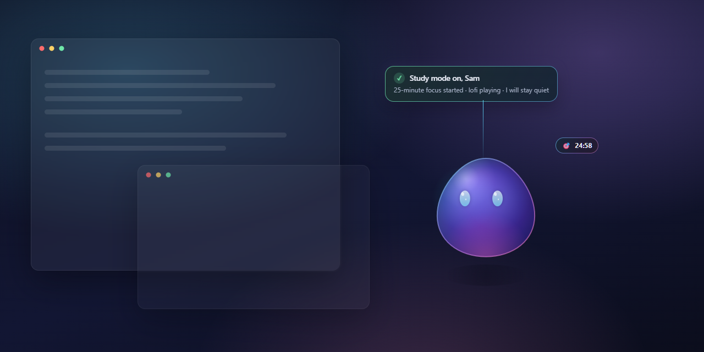
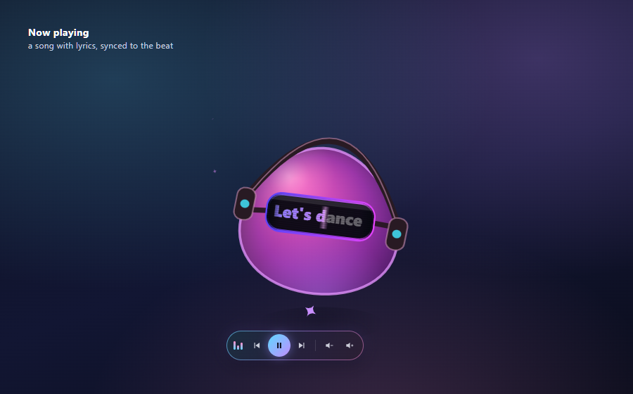
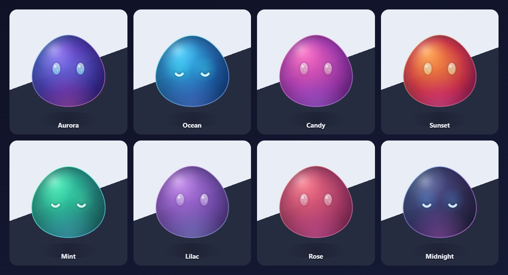
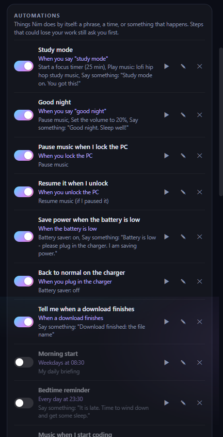
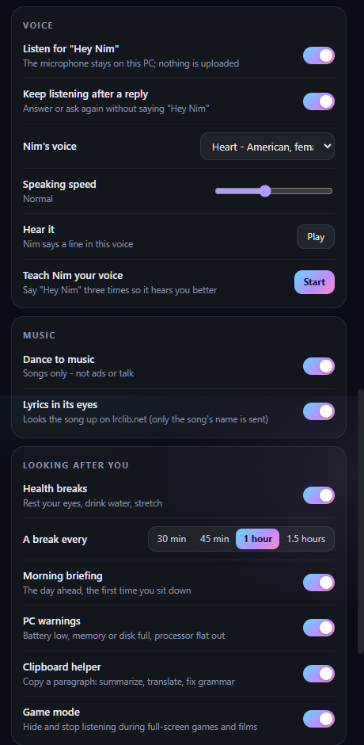

<div align="center">

# Nim

**A voice-controlled AI companion that lives on your Windows desktop.**

It listens for its name, talks back in a human-like voice, uses your PC for you,
dances to your music and looks after you - and everything it thinks with runs on
your own computer. No account, no API key, no paid service.




</div>

<table>
<tr>
<td width="50%"></td>
<td width="50%"></td>
</tr>
<tr>
<td><b>Dances to your music.</b> Finds the beat, sings along with the lyrics in its goggles, and has play, pause, skip and volume on its belly. Songs only - never ads, talk or a match with commentary.</td>
<td><b>Eight colour styles.</b> Glossy glass in Aurora, Ocean, Candy, Sunset, Mint, Lilac, Rose or Midnight, a small size, and see-through while you work so it is never in your way.</td>
</tr>
<tr>
<td></td>
<td></td>
</tr>
<tr>
<td><b>Automations.</b> Routines ("study mode"), schedules, and triggers - lock the PC and the music pauses, a download finishes and Nim tells you. It can even learn your habits and offer to do them.</td>
<td><b>Everything in one place.</b> 27 human-like voices, speaking speed, dancing and lyrics, health breaks, PC warnings, the clipboard helper and game mode - each a switch.</td>
</tr>
</table>

### What it does

- **Talk to it** - "Hey Nim, open Spotify", "remind me in 20 minutes to stretch", "what is 15 percent of 2400", "write a two line poem about rain".
- **Uses your computer** - apps, files and folders, web search and reading pages, screenshots, volume and media, reminders and notes.
- **Thinks on your PC** - fixed rules for everyday commands, [Qwen](https://ollama.com/library/qwen2.5) through Ollama for everything else, Whisper for hearing, Kokoro for a human-like voice.
- **Looks after you** - a focus timer, health breaks, PC health warnings, a morning briefing with the weather, a clipboard helper (summarize, translate, fix grammar) and quizzes to study with.
- **Safe by design** - every plan is checked before it runs; anything risky asks you first; it never types into a command line, never reaches your local network, never writes or opens a program. See [Safety](#safety).

```
microphone -> "Hey Nim" (Whisper) -> rules, or Qwen (Ollama) -> plan
           -> validator -> risk / your OK -> tools -> checked -> Nim answers
```

---

## Install (Windows 10 or 11)

Everything below is free and runs on your own computer. The big files (the
speech engine, the voices, the AI model) are downloaded separately, so the
repository stays small.

**1. Node.js and Nim**

Install [Node.js](https://nodejs.org) 20 or newer, then:

```bash
git clone https://github.com/om-jangam/nim-companion.git
cd nim-companion
npm install
```

**2. The brain: Ollama and Qwen** (for anything beyond the built-in commands)

Install [Ollama](https://ollama.com), then:

```bash
ollama pull qwen2.5:3b
```

Optional, for "what is on my screen?": `ollama pull moondream`.

**3. The ears: Whisper** (to talk to Nim; typing works without it)

- From the [whisper.cpp releases](https://github.com/ggml-org/whisper.cpp/releases/tag/v1.9.2)
  download `whisper-bin-x64.zip` (8 MB) and unzip it so that
  `vendor/whisper/Release/whisper-server.exe` and `whisper-cli.exe` exist.
- Download the speech models into `models/`:

```bash
mkdir models
curl -L -o models/ggml-base.en.bin https://huggingface.co/ggerganov/whisper.cpp/resolve/main/ggml-base.en.bin
curl -L -o models/ggml-small.en.bin https://huggingface.co/ggerganov/whisper.cpp/resolve/main/ggml-small.en.bin
```

The base model (148 MB) listens for "Hey Nim"; the small one (466 MB,
optional) hears what you ask more accurately.

**4. The voice: Kokoro** (human-like; recommended)

`npm install` already brought its engine (`sherpa-onnx-node`). The model is a
334 MB download, unpacked into `voices/kokoro/`:

```bash
mkdir -p voices/kokoro
curl -L -o kokoro.tar.bz2 https://github.com/k2-fsa/sherpa-onnx/releases/download/tts-models/kokoro-multi-lang-v1_0.tar.bz2
tar -xf kokoro.tar.bz2 -C voices/kokoro
```

27 voices (American and British, women and men); pick one in Settings. Use this
full model, not the int8 one: on laptop CPUs the int8 model was five times
slower.

Or the lighter **Piper** voice: from the [Piper releases](https://github.com/rhasspy/piper/releases/tag/2023.11.14-2)
unzip `piper_windows_amd64.zip` into `vendor/piper/` (so `vendor/piper/piper.exe`
exists), and put `en_US-amy-medium.onnx` and `en_US-amy-medium.onnx.json` from
[piper-voices](https://huggingface.co/rhasspy/piper-voices/tree/main/en/en_US/amy/medium)
into `voices/`. With neither, Nim uses the voices built into Windows.

**5. Start it**

```bash
npm start
```

Your settings are kept in `config.json` (made on first start, never
committed). `npm test` runs the tests.

## Using it

| what | how |
|---|---|
| talk to it | say **"Hey Nim"** and then what you want - or both in one breath: "Hey Nim, open Brave" |
| keep talking | after Nim answers it listens for about 8 seconds more - just say the next thing |
| push-to-talk | **hold Nim** still for a moment, speak, let go - or **Ctrl + Alt + V** |
| type to it | click Nim, or **Ctrl + Alt + Space** (**Ctrl + Alt + T** if another app owns that) |
| answer a question | **"Hey Nim, confirm"** / **"Hey Nim, cancel"**, or the buttons |
| stop | **"Hey Nim, stop"**, or Stop on the surface |
| move it | drag the body |
| hide / bring back | **Ctrl + Alt + N** |
| its menu | **right-click**: speak, type, focus, feed, microphone on/off, **Settings**, hide, quit |

Things to try: "volume down", "mute", "open Spotify", "open YouTube", "take a
screenshot", "open my Downloads folder", "search Google for Electron
documentation", "open Brave and search for Electron documentation", "play
Arijit Singh", "find my PDF and summarize it", "organize my Downloads folder",
"create a folder called Projects", "remind me in 20 minutes to stretch",
"read up on Electron IPC and save a summary as ipc.md", then "open that file".

## What you see

Three views of one Nim, all drawn from one shared state:

- **the creature** - its face is the status: listening, thinking, reaching out
  to the computer, receiving a result, weaving results together, speaking,
  pleased, upset, asleep.
- **the surface** - the light above its head grows into words when Nim has
  something to say ("◉ Listening...", "⚡ Opening Brave...", "✓ Brave is open",
  "Shut down your computer?  Cancel / Confirm") and folds back when it is done.
  It is part of Nim's own window, so it goes wherever you drag Nim. Nothing sits
  at the top of the screen.
- **the Dots** - small lights orbiting Nim: its local mind (Qwen) and ears
  (Whisper), and whatever it is working with right now - the browser, your
  files, the volume, reminders - tied to it by a thread while in use. Click one
  for what it is doing.

Touch Nim and choose Open for the full view: every step, its risk, and whether
it was verified.

## The microphone

Hearing "Hey Nim" means listening, on any assistant; Windows shows its
microphone icon whenever anything listens. Nim listens only while it can be
spoken to - switched on in its menu, the PC unlocked, Nim not hidden - and
releases the microphone otherwise. Audio is turned into words on this computer
and never saved. Switch listening off in the menu and the microphone is used
only while you hold Nim or press Ctrl + Alt + V.

How "Hey Nim" is heard (`src/desktop/wake.js`): a cheap loudness check finds
speech; the first second and a half is transcribed, primed with the name; if
that sounds anything like the name, the whole utterance is transcribed too, and
either can confirm it - with the same anchored patterns, so the name in the
middle of a sentence ("ask Nim to...") never wakes it, and "Hey Neil" heard as
"Hey Nim" by the first pass is caught by the second. If your voice keeps being
heard as some other spelling, add it to `wakeVariants` in `config.json`.

## Safety

- **Qwen proposes, the validator checks, the runtime runs.** Every plan - from
  the rules or the model - passes `src/agent/validator.js`: the tool must exist
  and be switched on, arguments must match its schema, paths must stay inside
  your own folders (no `..`, other drives, links leading out, `file://`,
  AppData, key files), projects must be ones you listed, web addresses must be
  http(s), the step graph must be sound.
- **There is no "run a command" tool.** Each capability is a narrow tool. The
  native parts of Windows (volume, windows, apps) are reached through
  `src/system/bridge.ps1`, which knows a fixed list of operations and never
  evaluates anything it is sent.
- **Risk is the registry's, never the model's**, and the runtime re-checks it
  right before each step. Low risk runs; medium and above asks first. Writing
  over an existing file, downloading a program, deleting (to the Recycle Bin),
  tidying a folder, closing an app, sleep, shutdown and restart all ask.
  Shutdown and restart wait 30 seconds and can be cancelled.
- **Done means checked.** An app counts as open when its window appears; a file
  as written when it reads back; the volume as changed when Windows reports the
  new level. What cannot be checked is reported as unchecked.
- **What a web page says cannot become a command.** Text Nim reads - a page, a
  song title, the clipboard, a file name - is only ever data:
  - Nim never types or pastes into a command line (Command Prompt, PowerShell,
    Terminal, WSL, SSH); if it cannot tell what is in front, it does not type.
  - Opening a command line, a script host or the registry editor asks first.
  - Nim never writes, renames, moves, copies or opens a program or script
    (`.exe`, `.bat`, `.ps1`, `.lnk`, `.msc`, `.settingcontent-ms`, disk images...).
    A download that turns out to be a program when it arrives is not saved.
  - The web tools and Nim's own browser go to the public internet only: never
    this computer or your network (routers, `localhost`, `192.168.x.x`, cloud
    metadata addresses), checked by name and by what the name resolves to,
    after every redirect.
- **The windows are locked down.** Every window is sandboxed with context
  isolation and no Node.js; each message from a window is checked for who sent
  it; the pages run only their own scripts (a strict Content-Security-Policy);
  only Nim's own window gets the microphone; no page can open windows or
  embed webviews. Nim's browser is a separate profile with no logins, no
  permissions and no downloads.
- `logs/audit.log` records each action's tool, risk, approval and outcome - never
  arguments, text or contents.
- `npm test` includes `test/security.test.js`, which tries these attacks for
  real. Found a hole? See [SECURITY.md](SECURITY.md).

## Looking after you

| | what | say or do |
|---|---|---|
| Focus timer | Pomodoro: a quiet, calm Nim and a timer pill; a break after, a long one every fourth | "focus for 25 minutes", "how much focus time is left", "stop focus" |
| Health breaks | after an hour at it without a rest: a stretch and a reminder (eyes, water, walk) | automatic |
| PC health | worried face and a word when the battery is low, the processor flat out, memory or the main drive full | automatic; "how is my PC?" |
| Briefing | the first time at the PC in the morning: time, today's reminders, the weather | automatic; "good morning", "brief me" |
| Weather | Open-Meteo (free, open, no key): only your city's name is sent | "my city is Pune", "what's the weather" |
| Clipboard helper | copy a paragraph: Summarize, Translate, Fix grammar. Never on passwords, keys, card numbers, code or links; the text is never kept or logged | copy some prose |
| Study buddy | a multiple-choice quiz from what you copied or what Nim just read, written by Qwen on this PC | "quiz me on that", "quiz me on what I copied" |
| Pet | feed it (menu), stroke it with the cursor; sleepy and yawning late at night; a wave when you are back | right-click menu; stroke it |
| Gaming mode | a game or a film full-screen: Nim hides and stops listening until it is over | automatic |

Each one can be switched off in **Settings** (right-click Nim). Copied text only ever goes into a fixed plan as material (summarize / translate / fix), checked by the validator; nothing in it can choose what Nim does.

## Automations

Things Nim does by itself, set up in **Settings > Automations**:

| kind | when | example |
|---|---|---|
| Routine | you say its phrase | "study mode": a 25-minute focus, lofi music, a word of encouragement |
| Schedule | at a time, every day / weekdays / weekends | weekdays at 8:30: the daily briefing |
| Trigger | an app opens, you lock or unlock the PC, you come back, a game starts or ends, the battery is low, the charger goes in, a download finishes | lock the PC: pause the music; unlock: play it again |
| Habit | Nim notices you open the same app at about the same time on four of the last fourteen days, and offers to do it for you | "You open Spotify around 9:00 most days. Want me to open it for you then?" |

Each step comes from a fixed menu (open or close an app, open a site, play / pause / resume music, volume, focus, quiet mode, battery saver, say something, weather, briefing, open a folder, lock the PC) and becomes an ordinary plan: checked by the validator, run by the runtime, and a risky step (closing an app) still asks. A question raised by a trigger that nobody answers is declined after two minutes. Ten starters come installed; the schedules start switched off, since only you know your times.

By voice: "what automations do I have", "turn off the good night routine", "run morning start", "quiet mode for an hour", "stop quiet mode", "battery saver on".

Habit learning keeps only each app's name and the time it came to the front, in `memory/habits.json`, for four weeks; switching **Learn my habits** off deletes it.

## Settings (`config.json`)

| key | what |
|---|---|
| `name` | what Nim calls you |
| `wakeWord` | listen for "Hey Nim" |
| `wakeVariants` | extra spellings of "Hey Nim" for your voice |
| `browser` | `brave`, `chrome`, `edge`, `firefox`, or empty: the one you have open, else the Windows default |
| `disabledTools` | tools Nim may never use, e.g. `["system.shutdown"]` |
| `projects` | folders Nim may inspect: `{ "myapp": "D:/code/myapp" }` |
| `brain.ollamaModel` | the local model (default `qwen2.5:3b`) |
| `diagnostics` | print what each stage heard and decided (also `NIM_DIAG=1`) |
| `city` | your city, for the weather and the briefing |
| `dailyBriefing`, `healthBreaks`, `pcHealth`, `clipboardHelper`, `hideWhenFullscreen` | the "Look after me" switches |
| `danceToMusic`, `lyrics` | dancing to what plays; timed lyrics from lrclib.net |
| `automations` | your routines, schedules and triggers (edit them in Settings) |
| `learnHabits` | notice which apps you open when, and offer to automate them |

## Where things are

| path | what it is |
|---|---|
| `src/companion/nim.js` | the creature |
| `src/desktop/main.js` | the window, the microphone policy, the one road from request to computer |
| `src/desktop/renderer.js` | voice, face, surface and Dots wiring |
| `src/desktop/wake.js` | "Hey Nim" |
| `src/desktop/surface.js`, `surface-model.js` | the floating surface |
| `src/desktop/dots.js` | the Dots |
| `src/core/bus.js`, `state.js` | the one event stream and the one state |
| `src/brain/` | rules, Qwen, the prompt and plan schema |
| `src/agent/validator.js` | the security boundary |
| `src/agent/runtime.js` | runs plans: risk, approval, verification, retries, audit |
| `src/agent/tools/` | every capability, one module per area |
| `src/agent/context.js` | what "that" and "it" refer to |
| `src/system/bridge.*` | the fixed native operations |
| `src/voice/` | Whisper (as a local server), Kokoro and Piper |

## Tests

```bash
npm test                          # everything; live parts skip if Ollama/Whisper are missing
set NIM_SKIP_LIVE=1&& npm test    # the fast, offline part only
```

`test/wake-audio.test.js` runs recorded "Hey Nim" phrases and hard negatives
through the real Whisper and the app's own decision. To exercise the real app
end to end - real window, real tools, real checks - with spoken recordings:

```bash
set NIM_DIAG=1&& set NIM_SELFTEST_WAKE=test\fixtures\wake\pos-ravi-hey-nim-time.wav&& npm start
```

`NIM_SELFTEST="open Brave||volume down"` does the same with typed requests.
The self-test declines anything that asks for approval; it never approves.

## Not yet

- Clicking, typing and tabs inside web pages (Nim opens, searches and reads
  pages, but does not drive them).
- Playing a song in Spotify by itself (it opens Spotify on the search; YouTube
  plays).
- Scanned PDFs (no text to read) and Word documents.
- A larger Whisper model or GPU Whisper for accents the base model mishears.

## License

MIT - see [LICENSE](LICENSE). Kokoro, sherpa-onnx (Apache-2.0), whisper.cpp and Piper (MIT)
are downloaded separately under their own licenses.
